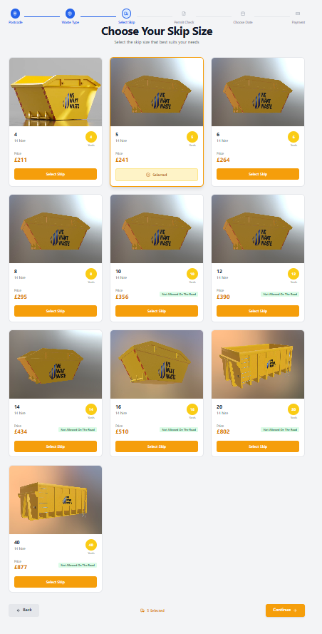

# We Want Waste - Modern Skip Hire Platform

## Live Demo

You can view the deployed version of the redesigned page here:
**[Netlify Deploy Link]** (e.g., `https://wewant-waste.netlify.app/`)

## Sandbox Environment

To inspect the code directly and see the development environment, you can access the CodeSandbox project here:
**[CodeSandbox Link]** (e.g., `https://codesandbox.io/p/github/TabbyMichael/We-Want-waste/We-Want-Waste-1.0.0?workspaceId=ws_Cr4TCY2SKeQCsoHRxPGwhT`)

## Project Overview

A comprehensive redesign and enhancement of the We Want Waste skip hire platform, featuring a modern, responsive interface with an intuitive multi-step booking flow. The application allows users to select their waste type, choose an appropriate skip size, and complete their booking with permit information.

**Key Features:**
- Multi-step booking flow with progress tracking
- Interactive skip selection with detailed information
- Waste type selection with helpful descriptions
- Permit requirement checking
- Responsive design for all device sizes
- Dark/Light mode support
- State persistence across navigation

## Screenshots

### Skip Selection


### Dark Mode


## 1. Project Structure

The application is built with React 18, TypeScript, and Tailwind CSS, following modern web development best practices.

### Core Components

- **SkipSelector**: Main component for displaying and selecting skips
- **WasteTypePage**: Handles waste type selection
- **PermitCheckPage**: Manages permit requirement checks
- **ProgressBar**: Visual indicator of booking progress
- **SkipCard**: Reusable component for displaying skip information

### State Management

- **SkipSelectionContext**: Manages global state for selected skip and summary view
- **useSkips Hook**: Handles data fetching and transformation for skip data
- **React Router**: Manages navigation between different steps of the booking flow

## 2. Technical Implementation

### Key Technologies

- **React 18**: For building the user interface
- **TypeScript**: For type safety and better developer experience
- **Tailwind CSS**: For responsive and maintainable styling
- **React Router**: For client-side routing
- **Vite**: For fast development and building
- **Lucide Icons**: For consistent, customizable icons

### Data Flow

1. **Data Fetching**: The `useSkips` hook fetches skip data from the API endpoint
2. **State Management**: Selected skip and UI state are managed via React Context
3. **Persistence**: User selections persist across navigation using localStorage
4. **Form Handling**: Controlled components manage form inputs and validation

## 3. Getting Started

### Prerequisites

- Node.js (v16 or later)
- npm or yarn

### Installation

1. Clone the repository:
   ```bash
   git clone https://github.com/TabbyMichael/We-Want-waste.git
   cd We-Want-waste
   ```

2. Install dependencies:
   ```bash
   npm install
   # or
   yarn install
   ```

3. Start the development server:
   ```bash
   npm run dev
   # or
   yarn dev
   ```

4. Open [http://localhost:5173](http://localhost:5173) in your browser.

## 4. Features

### Enhanced Skip Selection

- Interactive skip cards with hover effects
- Prominent display of skip details (size, price, hire period)
- Visual feedback for selected skips
- Responsive grid layout

### Waste Type Selection

- Intuitive waste type cards with icons
- Clear descriptions for each waste type
- Multi-select functionality
- Progress tracking

### Permit Check

- Simple permit requirement selection
- Clear guidance on permit rules
- Seamless integration with booking flow

### UI/UX Improvements

- Modern, clean interface with amber theme
- Responsive design for all screen sizes
- Smooth animations and transitions
- Accessible components
- Dark/light mode support

## 5. Future Enhancements

- [ ] User authentication
- [ ] Payment integration
- [ ] Order tracking
- [ ] Save favorite skips
- [ ] Enhanced mobile experience

## 6. Contributing

Contributions are welcome! Please feel free to submit a Pull Request.

## 7. License

This project is licensed under the MIT License - see the [LICENSE](LICENSE) file for details.